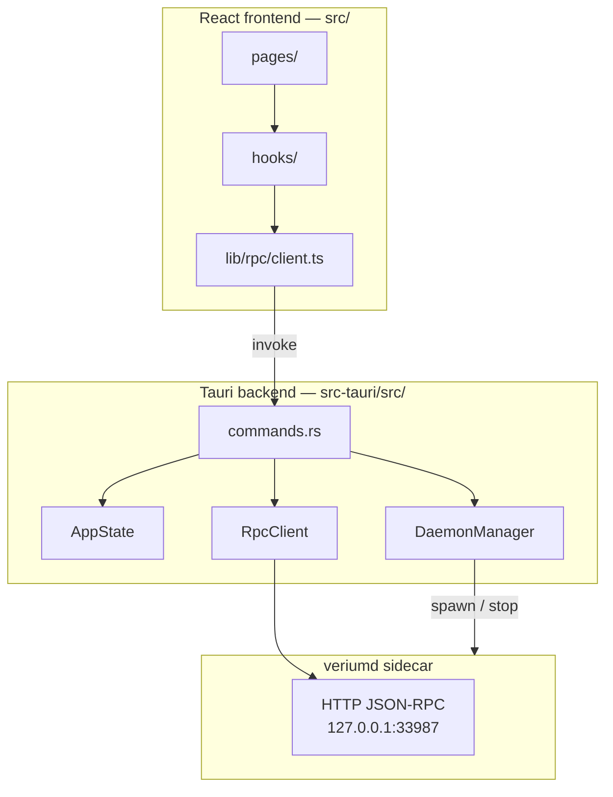

# Vericonomy Wallet (desktop)

Modern desktop wallet for [Verium](https://vericonomy.com) (VRM), built on **Tauri 2 + React + TypeScript**. It bundles and manages a `veriumd` node, provides an encrypted wallet UI, built-in CPU mining, and replaces the legacy Qt client for end-user installs.

**Branch:** [`tippy-gui-changes-modern-template`](https://github.com/JoshiOS-VRY/verium/tree/tippy-gui-changes-modern-template)  
**Location in repo:** `desktop/verium-app/`

---

## Overview

| Legacy (`verium-qt`) | New wallet (`verium-app`) |
| --- | --- |
| Qt GUI embedded in the same process as the node | React UI in a Tauri webview |
| In-process C++ interfaces | JSON-RPC to a managed `veriumd` subprocess |
| Single monolithic binary | App + bundled `veriumd` sidecar |

Consensus, wallet cryptography, P2P, and mining logic stay in the existing C++ core (`src/`). This app is a **control shell**: it starts/stops `veriumd`, calls wallet/mining RPCs, reads `debug.log`, and stores app preferences locally.

For the migration rationale and phased rollout plan, see [`doc/desktop-modernization-plan.md`](../../doc/desktop-modernization-plan.md).

---

## Architecture



### Request flow

1. React calls a typed wrapper in `src/lib/rpc/client.ts` (e.g. `rpcGetWalletInfo()`).
2. Tauri invokes a Rust command in `src-tauri/src/commands.rs`.
3. Rust builds an HTTP JSON-RPC client (`rpc.rs`) using credentials from `verium.conf` or `.cookie`.
4. `veriumd` executes the method and returns JSON; Rust deserializes and sends the result back to the UI.

Some work never hits RPC: preferences, address book, log tailing, bootstrap download, explorer proxy, and process lifecycle are handled in Rust with direct filesystem/process access.

### Daemon lifecycle

- **Start:** Setup wizard or Settings → `start_daemon` spawns `veriumd` with `-datadir`, `-server=1`, `-rpcport`, `-rpcbind`. The child is tracked in `DaemonManager`.
- **Run:** Frontend polls `get_node_status` via `useDaemonStatus` (adaptive 2–10s interval).
- **Quit:** On app exit, bundled installs call RPC `stop` and release the datadir lock so another wallet instance can start.

Sidecar binary resolution (`daemon.rs`): bundled `veriumd` next to the app → `VERIUMD_PATH` / PATH → (Windows dev only) WSL `veriumd`.

### Frontend design

| Layer | Technology | Role |
| --- | --- | --- |
| UI | React 18, Tailwind CSS, Lucide icons | Pages and components |
| Routing | React Router 6 | `/setup` wizard + shell routes under `AppShell` |
| Server state | TanStack React Query 5 | RPC polling, mutations, cache invalidation |
| Client prefs | Zustand | `user-preferences.ts`, `toast-store.ts` |
| Side effects | Custom hooks in `hooks/` | Auto-mine, block-found chime, incoming-VRM toasts, theme |
| IPC | `@tauri-apps/api` | All backend calls through `invoke()` |

Global hooks mount once in `App.tsx`: theme, auto-mine, block-mined watcher/sound, incoming VRM watcher/notifications, Web Audio unlock.

### Backend modules (`src-tauri/src/`)

| Module | Purpose |
| --- | --- |
| `lib.rs` | Tauri builder, plugins, command registration, startup/shutdown hooks |
| `commands.rs` | All `#[tauri::command]` handlers (~60): wallet, mining, daemon, bootstrap, WSL |
| `state.rs` | Shared `AppState` (config, miner state, daemon manager) |
| `config.rs` | Datadir, `verium.conf`, RPC bootstrap, `daemon.json`, wallet path resolution |
| `daemon.rs` | Sidecar detection, spawn/kill child process |
| `rpc.rs` | reqwest JSON-RPC client (cookie / user+pass auth) |
| `prefs.rs` | `prefs.json` load/save |
| `addressbook.rs` | `addressbook.json` CRUD |
| `bootstrap.rs` | Chain snapshot download from CDN |
| `logs.rs` | Tail `debug.log`, corruption/sync-stall detection |
| `explorer_api.rs` | Proxy to public explorer REST API |
| `updates.rs` | Version check (CDN + bundled manifest) |
| `wsl.rs` | Windows WSL dev: start/stop/rebuild `veriumd` in Linux |

---

## Project structure

```
desktop/verium-app/
├── src/                    # React + TypeScript (Vite)
│   ├── pages/              # Route screens (Dashboard, Wallet, Mining, …)
│   ├── components/         # Feature + layout components
│   ├── hooks/              # Cross-cutting React hooks
│   └── lib/                # RPC client, prefs, utilities, sounds
├── src-tauri/
│   ├── src/                # Rust backend (see table above)
│   ├── binaries/           # veriumd-<triple>{.exe} sidecar (gitignored; fetched)
│   ├── tauri.conf.json     # Bundle config, externalBin sidecar
│   └── Cargo.toml
├── scripts/
│   ├── fetch-veriumd.cjs    # Download or copy sidecar binary
│   ├── run-tauri-dev.cjs     # Platform-aware dev entry
│   └── tauri-dev.ps1         # Windows: load MSVC, run tauri dev
├── TESTING.md              # Release QA checklist
└── CHANGELOG.md            # Release notes (used by CI)
```

---

## Dependencies

### Frontend (`package.json`)

| Package | Use |
| --- | --- |
| `react`, `react-dom`, `react-router-dom` | UI and routing |
| `@tanstack/react-query` | Async state / RPC polling |
| `zustand` | Preferences and toasts |
| `recharts` | Mining hashrate chart |
| `lucide-react`, `clsx`, `tailwind-merge` | Icons and styling |
| `@tauri-apps/api` | IPC to Rust |
| `@tauri-apps/plugin-dialog`, `plugin-fs`, `plugin-shell` | Native dialogs and shell |
| `vite`, `typescript`, `tailwindcss` | Build toolchain |

### Backend (`src-tauri/Cargo.toml`)

| Crate | Use |
| --- | --- |
| `tauri` 2 + plugins | Desktop shell, dialog, fs, shell |
| `tokio` | Async runtime, process spawn |
| `reqwest` | HTTP JSON-RPC to `veriumd` |
| `serde` / `serde_json` | Serialization |
| `dirs` | Platform data/config paths |
| `chrono`, `uuid` | Timestamps, IDs |
| `zip` | Bootstrap archive extraction |
| `tracing` | Structured logging (`RUST_LOG=info` in dev) |

### External runtime

- **`veriumd`** — bundled as a Tauri sidecar (`externalBin: ["binaries/veriumd"]`), fetched before dev/build.
- **Node.js 20+** and **Rust stable** (edition 2021, MSRV 1.77) — required to build the app itself.

---

## Local development

### Prerequisites

| Platform | Install |
| --- | --- |
| **All** | [Node.js 20+](https://nodejs.org/), [Rust stable](https://rustup.rs/) |
| **Windows** | Visual Studio 2022 with **Desktop development with C++** (`link.exe`). Use `npm run tauri:dev` — it loads MSVC via `scripts/load-win-build-env.ps1`. |
| **Linux** | WebKit/GTK dev packages (see CI list below) |
| **macOS** | Xcode Command Line Tools |

### Clone and run

```bash
git clone https://github.com/JoshiOS-VRY/verium.git
cd verium
git checkout tippy-gui-changes-modern-template

cd desktop/verium-app
npm install

# Download veriumd sidecar for your platform (required before tauri dev/build)
npm run fetch:veriumd

# Start the app (Vite + Tauri + spawns UI)
npm run tauri:dev
```

On **Windows**, prefer `npm run tauri:dev` over `tauri dev` directly so the MSVC linker environment is set up.

### Sidecar options

```bash
# Use your own built veriumd instead of CDN download
VERIUMD_LOCAL=/path/to/veriumd npm run fetch:veriumd

# Offline placeholder (cargo check / manifest validation only — node won't run)
npm run fetch:veriumd:stub

# Skip re-download if sidecar already present (used in CI build)
npm run fetch:veriumd:if-missing
```

CDN base: `https://files.vericonomy.com/vrm/releases/` (version from `src/lib/releases-manifest.json` or `VERIUMD_VERSION`).

### npm scripts

| Script | Description |
| --- | --- |
| `npm run dev` | Vite only (no Tauri shell) |
| `npm run tauri:dev` | Full desktop app in dev mode |
| `npm run tauri:build` | Production installer/bundle |
| `npm run lint` | TypeScript project check |
| `npm run build` | Frontend production build only |
| `npm run fetch:veriumd` | Fetch/copy sidecar into `src-tauri/binaries/` |

### First launch (dev)

1. App opens the **Setup** wizard if the node is not connected and setup is incomplete.
2. Click **Start node and continue** — provisions RPC creds in `verium.conf` if needed, spawns `veriumd`.
3. Create or unlock the encrypted wallet, then land on **Dashboard**.

Data directory defaults match the legacy client so existing chain/wallet data is reused:

| OS | Chain + wallet data | App prefs |
| --- | --- | --- |
| Windows | `%APPDATA%\Verium` | `%APPDATA%\Verium\desktop-app\` |
| macOS | `~/Library/Application Support/Verium` | same tree / `desktop-app/` |
| Linux | `~/.verium` | `~/.config/Verium/desktop-app/` |

Wallet file: `<datadir>/wallets/wallet.dat` (or legacy `<datadir>/wallet.dat`).  
Wallet backups default to `<datadir>/backups/verium-wallet-YYYYMMDD-HHMMSS.dat`.

### Windows WSL development (optional)

When no bundled sidecar is present, the app can auto-detect a WSL datadir (`\\wsl$\...`) and manage `veriumd` inside Linux. Build `veriumd` in WSL (`~/verium/src/veriumd`), point Settings → Daemon connection at the WSL UNC path, and use the WSL restart helpers. Shipped/bundled builds always use native Windows `veriumd`.

### Linux system packages (CI reference)

```bash
sudo apt-get install -y \
  libwebkit2gtk-4.1-dev libappindicator3-dev librsvg2-dev patchelf \
  build-essential curl wget file libssl-dev libgtk-3-dev libfuse2
```

### Production build

```bash
npm run fetch:veriumd
npm run tauri:build          # or tauri:build:msvc on Windows
```

Artifacts land under `src-tauri/target/<triple>/release/bundle/`. CI builds Windows (MSI/NSIS), macOS (DMG), and Linux (deb/AppImage) — see [`.github/workflows/desktop-app.yml`](../../.github/workflows/desktop-app.yml).

Tag releases with `desktop-v*` to trigger the draft GitHub Release job.

---

## Configuration files

| File | Written by | Contents |
| --- | --- | --- |
| `<datadir>/verium.conf` | App first-run + Settings | RPC port, `rpcuser`/`rpcpassword`, chain flags |
| `<datadir>/desktop-app/daemon.json` | App | Saved datadir, RPC host/port (no secrets) |
| `<datadir>/desktop-app/prefs.json` | App | Theme, mining prefs, sounds, fees, setup flag |
| `<datadir>/desktop-app/addressbook.json` | App | Address book entries |

RPC console command history is stored in browser `localStorage` only (see [`docs/SECURITY.md`](../../docs/SECURITY.md)).

---

## Related documentation

| Document | Topic |
| --- | --- |
| [`doc/desktop-modernization-plan.md`](../../doc/desktop-modernization-plan.md) | Migration strategy, RPC transport, phased rollout |
| [`docs/SECURITY.md`](../../docs/SECURITY.md) | Passphrase handling, RPC exposure, storage |
| [`TESTING.md`](TESTING.md) | Pre-release QA checklist |
| [`doc/JSON-RPC-interface.md`](../../doc/JSON-RPC-interface.md) | `veriumd` RPC reference |
| [`doc/verium-conf.md`](../../doc/verium-conf.md) | Daemon configuration options |
| [`doc/build-windows.md`](../../doc/build-windows.md) | Building `veriumd` from source (for `VERIUMD_LOCAL`) |

---

## End users

Pre-built installers are published on [GitHub Releases](https://github.com/JoshiOS-VRY/verium/releases) (`desktop-v*` tags).

| Platform | Typical asset |
| --- | --- |
| Windows 10/11 | `*_x64-setup.exe` |
| macOS (Intel) | `*_x64.dmg` |
| Linux | `.deb` or `.AppImage` |

**Backup:** Settings → Wallet backup & passphrase → choose a **new** filename in the `backups` folder (never overwrite live `wallet.dat`).

**Troubleshooting:** If the node is unreachable on first launch, wait 10–30s for block index load, then Settings → Daemon connection → Test connection. See [`TESTING.md`](TESTING.md) for full QA scenarios.

---

## License

MIT — same as the Verium repository.
